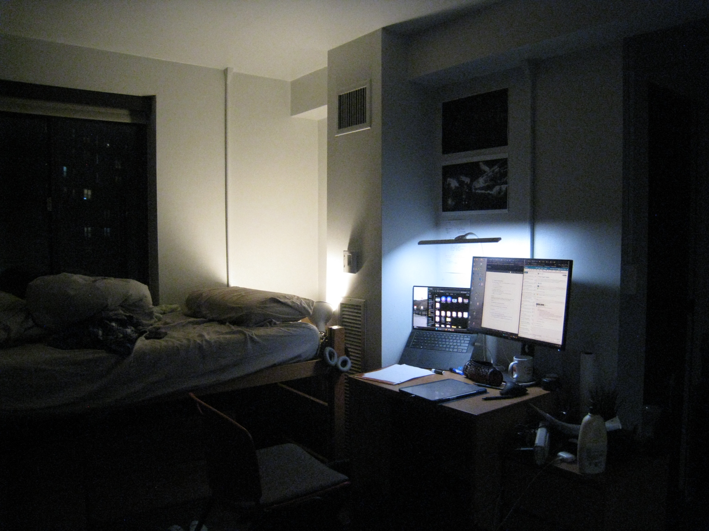
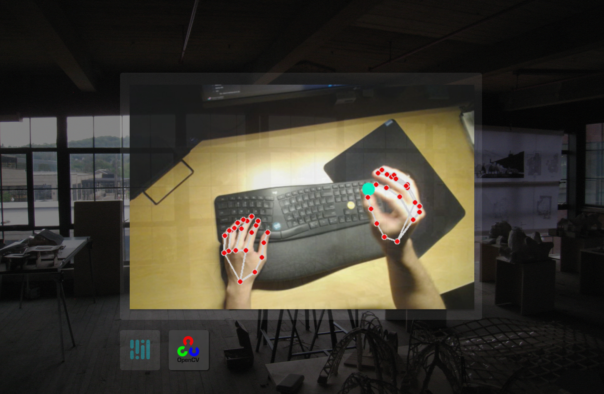

# Taskman: How Gestures and Voice Shape Our Digital Workflow

In a world dominated by clicks and keystrokes, we've overlooked a powerful, innate tool for thought and organization: our hands. Cognitive science, as highlighted by researcher David McNeill, reveals that gestures are not mere afterthoughts but integral parts of our thought processes. This project explores that forgotten connection, moving beyond the screen to create a productivity tool that leverages natural, embodied interaction to enhance focus and reduce cognitive load.

## Project Summary & Achievements

This project, codenamed "Taskman," is a hands-free productivity dashboard designed to be projected onto any physical surface selected to be presented at the Meeting of the Minds Carnegie Mellon Research Symposium. It serves as an ambient, secondary workspace for managing daily tasks and calendar events without ever touching a keyboard or mouse.

The primary achievement is the creation of a fluid, low-latency control system that seamlessly translates physical actions into digital commands. Users can navigate their calendar with swipes in the air, complete checklist items with a "click" gesture, and converse with a voice-powered AI assistant to ask questions. This fosters a more intuitive and less stressful relationship with task management, directly addressing the cognitive overload common in today's fast-paced environments.

## Technology Stack

| Layer            | Key Technologies                                              | Purpose / Role                                                                                          |
|------------------|--------------------------------------------------------------|----------------------------------------------------------------------------------------------------------|
| **Frontend**     | React, Framer Motion                                         | Single-page UI with smooth, component-based animations                                                   |
| **Backend**      | Python, FastAPI, WebSockets, SQLAlchemy + SQLite             | High-performance API server, real-time bidirectional comms, persistent storage for tasks & calendar      |
| **AI / ML**      | OpenCV + MediaPipe (hand tracking)                           | Real-time gesture detection & command translation                                                       |
|                  | Google Cloud Speech-to-Text (streaming)                      | Fast, accurate voice transcription                                                                       |
|                  | Google Vertex AI (Gemini)                                    | Conversational response generation powering the voice assistant                                          |

## Demo

*Demo video showing functionalities of dashboard*

## References

Britton, B. K., & Tesser, A. (1991). Effects of time-management practices on college grades. *Journal of Educational Psychology, 83*(3), 405–410.

Höök, K. (2018). *Designing with the Body: Somaesthetic Interaction Design*. MIT Press.

Macan, T. H. (1994). Time management: Test of a process model. *Journal of Applied Psychology, 79*(3), 381–391.

McNeill, D. (1992). *Hand and Mind: What Gestures Reveal About Thought*. University of Chicago Press.
